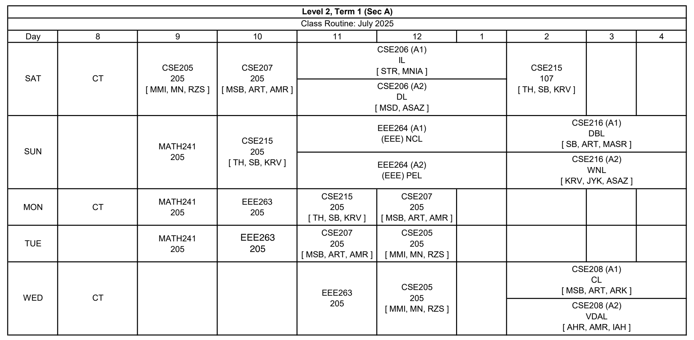

# CSE Level-2 Term-1 – Section A Resources

Welcome to the central resource hub for L2-T1 (Sec A).  
All course materials, slides, sheets, solutions, codes, and notes will be organized here.

---

## How to use this repo?
1. First download the repo by cloning, goto the terminal / command-promt
   
    ```bash
    git clone https://github.com/BUETCSE23/2-1-SecA.git
    cd 2-1-SecA
    ```

2. Whenever you want to update your local clone, goto the terminal / command-promt
   ```bash
   cd 2-1-SecA
   git pull
   ```

---

### You can explore the [website!](https://buetcse23.github.io/2-1-SecA/) :hugs:
### Also the [GitHub-repo](https://github.com/BUETCSE23/2-1-SecA/)
---

## 🔹 Class Routine

<table align="center">
  <tr align="center">
    <th>Day</th>
    <th>8 AM</th>
    <th>9 AM</th>
    <th>10 AM</th>
    <th>11 AM</th>
    <th>12 PM</th>
    <th>1 PM</th>
    <th>2 PM</th>
    <th>3 PM</th>
    <th>4 PM</th>
  </tr>

  <tr>
    <td><b>SAT</b></td>
    <td>CT</td>
    <td>CSE205</td>
    <td>CSE207</td>
    <td colspan="3" align="center">CSE206</td>
    <td>CSE215</td>
    <td></td>
    <td></td>
  </tr>

  <tr>
    <td><b>SUN</b></td>
    <td></td>
    <td>MATH241</td>
    <td>CSE215</td>
    <td colspan="3" align="center">EEE264</td>
    <td colspan="3" align="center">CSE216</td>
  </tr>

  <tr>
    <td><b>MON</b></td>
    <td>CT</td>
    <td>MATH241</td>
    <td>EEE263</td>
    <td>CSE215</td>
    <td>CSE207</td>
    <td></td>
    <td></td>
    <td></td>
    <td></td>
  </tr>

  <tr>
    <td><b>TUE</b></td>
    <td></td>
    <td>MATH241</td>
    <td>EEE263</td>
    <td>CSE207</td>
    <td>CSE205</td>
    <td></td>
    <td></td>
    <td></td>
    <td></td>
  </tr>

  <tr>
    <td><b>WED</b></td>
    <td>CT</td>
    <td></td>
    <td></td>
    <td>EEE263</td>
    <td>CSE105</td>
    <td></td>
    <td colspan="3" align="center">CSE208</td>
  </tr>
</table>


<!--
| Day   | 8       | 9        | 10       | 11       | 12       | 1 PM | 2 PM    | 3 PM | 4 PM |
|-------|---------|----------|----------|----------|----------|------|---------|------|------|
| SAT   | CT      | CSE205   | CSE207   | CSE206   |          |      | CSE215 |      |      |
| SUN   |         | MATH241  | CSE215   | EEE264   |          |      | CSE216 |      |      |
| MON   | CT      | MATH241  | EEE263   | CSE215   | CSE207   |      |        |      |      |
| TUE   |         | MATH241  | EEE263   | CSE207   | CSE205   |      |        |      |      |
| WED   | CT      |          |          | EEE263   | CSE205   |      | CSE208 |      |      |
-->
## 📘 Course Resources

### 🔹 CSE 205 — Digital Logic Design  
- [Course Outline](./CSE205/CSE205_Course_Outline.pdf)
- [Monirul Sir](./CSE205/MonirulSir/)
  - [Chapter 1](./CSE205/MonirulSir/CSE205_chapter1.pdf)
  - [Chapter 2](./CSE205/MonirulSir/CSE205_chapter2.pdf)
  - [Chapter 3](./CSE205/MonirulSir/CSE205_chapter3.pdf)
  - [Chapter 4](./CSE205/MonirulSir/CSE205_chapter4.pdf)
  - [Chapter 5](./CSE205/MonirulSir/CSE205_chapter5.pdf)
  - [Chapter 6](./CSE205/MonirulSir/CSE205_chapter6.pdf)
  - [Chapter 7](./CSE205/MonirulSir/CSE205_PLA_design_chapter7.pdf)
  - [Chapter 9](./CSE205/MonirulSir/CSE205_chapter9.pdf)
- [Sojib Sir](./CSE205/SojibSir/)
- [Nazneen Madam](./CSE205/NazneenMadam/)

### 🔹 CSE 206 — Digital Logic Design Sessional 
- [Course Outline](./CSE206/CSE206_Course_Outline.jpg) 
- [IC Handbook](./CSE206/IC_Handbook.pdf)
- [Lab Sheet](./CSE206/LabSheet/)

### 🔹 CSE 207 — Data Structures and Algorithms II  
- [Course Outline](./CSE207/CSE207_Course_Outline.pdf)
- [Rumi Sir](./CSE207/RumiSir/)
  - [BFS-DFS](./CSE207/RumiSir/BFS-DFS.pdf)
- [Tushar Sir](./CSE207/TusharSir/)
- [Bayzid Sir](./CSE207/BayzidSir/)


### 🔹 CSE 208 — Data Structures and Algorithms II Sessional
- [Course Outline](./CSE208/CSE208_Course_Outline.pdf)
- []()

### 🔹 CSE 215 — Database 
- [Course Outline](./CSE215/CSE215_Course_Outline.pdf)
- [Tanzima Madam](./CSE215/TanzimaMadam)
  - [Introduction](./CSE215/TanzimaMadam/Introduction.pdf)
  - [ER Diagram](./CSE215/TanzimaMadam/Lecture2.pdf)
- [Sukarna Sir](./CSE215/SukarnaSir/)
- [Kowshic Sir](./CSE215/KowshicSir/)

### 🔹 CSE 216 — Database Sessional  
- [Course Outline](./CSE216/CSE216-Course-Outline.pdf)
- [Sample Project Topics](./CSE216/CSE216-Sample-Project-Topics.pdf)
- [Oracle SQL Book](./CSE216/Oracle-SQL-PL-SQL.pdf)


### 🔹 EEE 263 — Electronic Circuits
- [Course Outline](./EEE263/EEE263_Course_Outline.pdf)
- [Text Book](./EEE263/Books/Sedra_7th.pdf)
- [Solution Book](./EEE263/Books/Sedra_7th_soln.pdf)
- Class Lectures
  - [Lec-1](./EEE263/Whiteboards/L1-intro-diode.pdf)
  <!-- - [Lec-2](./EEE263/Whiteboards/L2-diode-circuit.pdf)
  - [Lec-3](./EEE263/Whiteboards/L3-bjt-intro.pdf)
  - [Lec-4](./EEE263/Whiteboards/L4-bjt-circuit.pdf)
  - [Lec-5](./EEE263/Whiteboards/L5-bjt-amplifier.pdf)
  - [Lec-6](./EEE263/Whiteboards/L6-fet-intro.pdf)
  - [Lec-7](./EEE263/Whiteboards/L7-fet-circuit.pdf) -->


### 🔹 EEE 264 — Electronic Circuits Sessional
- [Course Outline](./EEE264/EEE264_Course_Outline.pdf)
- [Lab Sheet](./EEE264/LabSheet/EEE264-LabSheet.pdf)

### 🔹 MATH 241 — Advanced Calculus
- [Course Outline](./MATH241/MATH241_Course_Outline.pdf)
- [PDE](./MATH241/PDE-Alim-Sir/)
  - [Text Book](./MATH241/PDE-Alim-Sir/Raishinghania.pdf)
- [Vector Calculus](./MATH241/Vector/)
  - [Text Book](./MATH241/Vector-Obayedullah-Sir/Schaums.pdf)
  - [Text Book Solution](./MATH241/Vector-Obayedullah-Sir/Schaums_Solution.pdf)
- [Complex](./MATH241/Complex/)
  - [Text Book](./MATH241/Complex/Schaums.pdf)
  - [Text Book Solution](./MATH241/Complex/Schaums_Solution.pdf)

---

## ✔ General  
- [L2-T1 Sec A GitHub-repo](https://github.com/BUETCSE23/2-1-SecA/)
- [L2-T1 Sec A Website](https://buetcse23.github.io/2-1-SecA/)
- [Academic Calendar July 2025](./AcademicCalendarJuly2025.pdf)
- [Class Routine July 2025](./July_2025_level_term_v_1.pdf)

## ✔ Notes  
This repo will be updated throughout the term.  
Feel free to report broken links or missing files.


